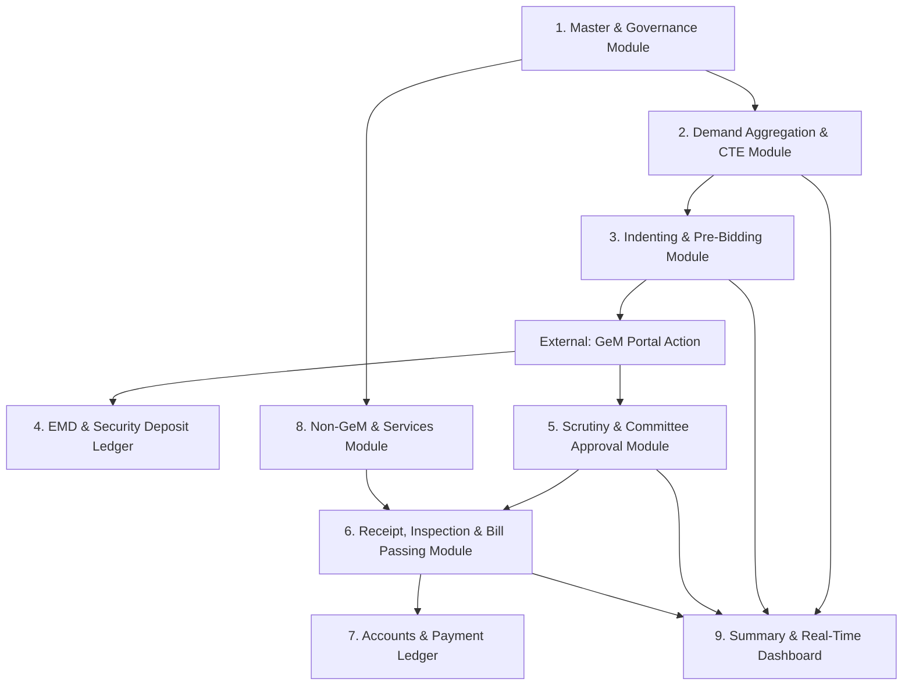
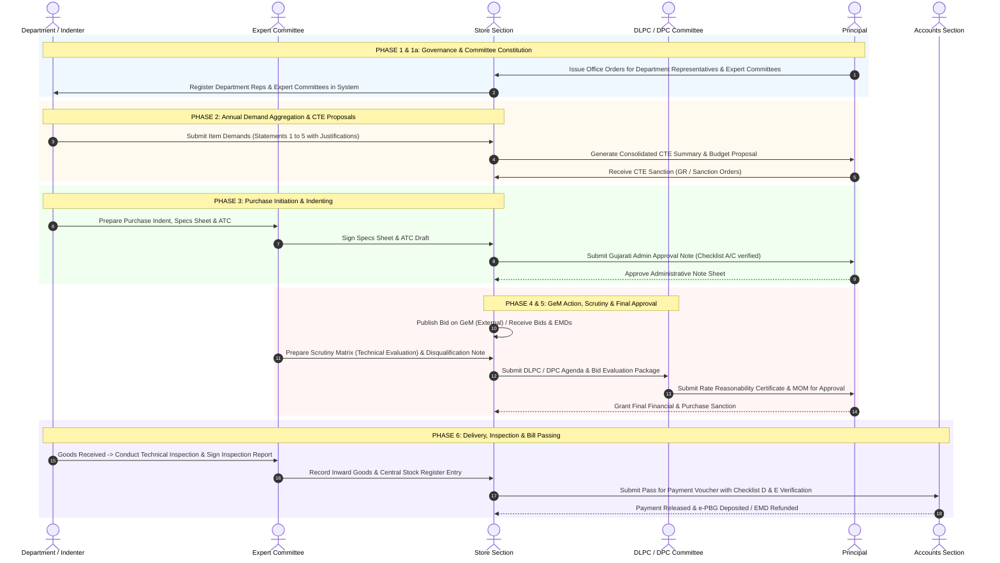

# Store & Purchase Management System – Architecture, System Overview & End-to-End Procurement Lifecycle

## Executive Summary & System Vision

### Background & Objective
**L.D. College of Engineering (LDCE), Ahmedabad** conducts extensive annual procurements spanning scientific equipment, IT hardware, laboratory instruments, office furniture, books, maintenance contracts, repairs, and general services across 20+ academic departments and administrative units.

Currently, procurement templates exist as disconnected Microsoft Word (`.docx`), Excel (`.xlsx`), and PDF documents organized across ordered folders (numbered 1 through 4, along with Summary, Committee, Accounts, and Services). The objective of the **Store & Purchase Management System** is to digitalize and automate the entire procurement workflow, maintain a centralized database for all requests, generate all official notes/orders/certificates/vouchers automatically, and provide real-time tracking across all funding heads (State Grants like TED-5/TED-11, Contingency, Student Welfare, Gymkhana, SSIP, CoE, etc.).

### System Scope: System vs. GeM Portal Integration
The system is designed to work in synergy with the **Government e-Marketplace (GeM) Portal**:

```
+-----------------------------------------------------------------------------------------+
|                              STORE & PURCHASE MANAGEMENT SYSTEM                         |
|                                     (Internal Platform)                                 |
|                                                                                         |
|  [Phase 1] Committee Constitution & Master Management                                   |
|  [Phase 2] CTE Proposal & Annual Budget Aggregation (Statements 1-5)                   |
|  [Phase 3] Indenting, Technical Specs, Common ATC & Initiate Note Sheets                 |
|  [Phase 3a] Pre-Bid Checklists (Checklist A / C Verification)                            |
+------------------------------------------+----------------------------------------------+
                                           |
                                           v  (Data export / Bid details copy-paste)
+------------------------------------------+----------------------------------------------+
|                                    GeM PORTAL                                           |
|                                 (External Action)                                       |
|                                                                                         |
|  * Publish Bids (Custom Bid / BOQ / Service Bid)                                        |
|  * Direct Purchase / L1 Purchase                                                        |
|  * Vendor Bid Submission & Financial Bidding                                            |
|  * Reverse Auction (RA) & GeM Order Generation                                          |
+------------------------------------------+----------------------------------------------+
                                           |
                                           v  (Bid numbers, L1 rates, vendor data input)
+------------------------------------------+----------------------------------------------+
|                              STORE & PURCHASE MANAGEMENT SYSTEM                         |
|                                     (Internal Platform)                                 |
|                                                                                         |
|  [Phase 4] EMD Ledger & Security Deposit (e-PBG) Demand Draft Tracking                  |
|  [Phase 5] Scrutiny Matrix, Disqualification Notes & Committee Evaluation               |
|  [Phase 5a] DLPC / DPC Agendas, MOMs, Rate Reasonability & Approval Orders             |
|  [Phase 6] Goods Receipt, Technical Inspection, Stock Entry & Pass for Payment          |
|  [Phase 6a] Bill Verification Checklists (Checklist D & E)                              |
|  [Phase 7] Non-GeM, Service Contracts & Equipment Repair Workflows                      |
|  [Phase 8] Executive Dashboards & Grant Status Monitoring                               |
+-----------------------------------------------------------------------------------------+
```

---

## Core System Architecture & Modules



### Module Breakdown
1. **Master & Governance Module**: Manages departments, academic disciplines, user roles, designated department representatives, expert committees per subject matter, DLPC/DPC committee members, and vendor master.
2. **Demand Aggregation & CTE Module**: Captures departmental New Item (NI) demands, generates CTE Statements 1 to 5 (Non-IT, IT, Furniture, Books, Maintenance), calculates lifetime usage, norm compliance, and compiles institute-wide CTE summary reports.
3. **Indenting & Pre-Bidding Module**: Enables digital purchase indents (Govt. / Non-Govt. funds), generates detailed Specification Sheets, auto-compiles Additional Terms & Conditions (ATC), executes Gujarati administrative note sheets, and runs Checklist A and C validation before bidding.
4. **EMD & Security Deposit Ledger Module**: Tracks EMD Earnest Money Deposits and e-PBG Performance Bank Guarantees, logs D.D. details, generates EMD Return Letters for un-selected vendors, and prepares Account submission notes for SD deposits.
5. **Scrutiny & Committee Approval Module**: Captures bid responses, generates multi-vendor Scrutiny Reports (Technical Evaluation Matrix), handles disqualification justifications, compiles DLPC (≤ Rs 5 Lakhs) and DPC (> Rs 5 Lakhs) Agendas, Rate Reasonability Certificates, Minutes of Meetings (MOM), and Principal Approval Forwarding Letters.
6. **Receipt, Inspection & Bill Passing Module**: Logs Goods Inward Receipts, generates Expert Committee Technical Inspection Reports, records Central Store Stock Register entries (Folio & Page Nos.), produces Pass for Payment Vouchers, and verifies Checklist D & E prior to Account submission.
7. **Services, Repair & Non-GeM Module**: Maintains non-working equipment logs, processes repair approval notes, issues local inquiry letters, generates Comparative Statements (Govt. / Non-Govt.), creates Purchase Orders (PO) & Work Orders (WO), and passes repair bills.
8. **Real-time Executive Dashboard**: Provides interactive status of grant utilization (TED-5, TED-11, etc.), department-wise bid status, financial progress, and pending approvals.

---

## Detailed Step-by-Step Procurement Process Flow



---

### Phase 1 & 1a: Institutional Governance & Committee Setup
1. **Annual Committee Notification**:
   - At the beginning of each financial year (e.g., 2026-27), office orders are published designating:
     - **Department Representatives** (2 members per department across Applied Mechanics, Automobile, Biomedical, Chemical, Civil, Computer, EC, Electrical, Environmental, IC, IT, Library, Mechanical, Plastic, Rubber, Science & Humanities, Textile, Admin, Student Section, Hostel).
     - **Expert Committees** (3–5 subject domain experts per discipline).
     - **Specialized Committees** (Local Purchase Committee DLPC, Write-off Committee, AC Purchase Committee).
2. **Modifications / Note for Change**:
   - When faculty or staff members transfer or change roles, the system processes a **Note for Change in Expert Committee / Representatives** for Principal approval.

---

### Phase 2: Demand Planning & Annual CTE Proposal
1. **Departmental Demand Input**:
   - Departments enter annual requirements into five structured formats:
     - **Statement 1**: Non-IT Equipment (Approx rate, GeM availability, grant head, norm calculation, lifespan, maintenance plan, usage justification).
     - **Statement 2**: IT Equipment (PCs, Laptops, Printers, Scanners, Networking).
     - **Statement 3**: Furniture (Tables, Chairs, Benches, Cabinets).
     - **Statement 4**: Library Books & Subscriptions.
     - **Statement 5**: Maintenance & AMC Contracts.
2. **CTE Summary Compilation**:
   - System aggregates requirements across departments and computes budget totals for items < Rs 5.00 Lakhs vs. > Rs 5.00 Lakhs.
   - Outputs official **CTE Summary Sheets** for submission to the Commissionerate of Technical Education (CTE, Gandhinagar).

---

### Phase 3: Purchase Initiation, Indenting & Pre-Bidding
1. **Indent Creation**:
   - Indenter creates a **Purchase Indent** (Govt. Fund or Non-Govt. Fund e.g. Student Welfare, Gymkhana, SSIP, Siemens CoE).
2. **Specification & ATC Drafting**:
   - Expert Committee drafts the **Specification Sheet** (including consignee department allocation).
   - Additional Terms & Conditions (ATC) are generated including warranty, preventive maintenance schedule, delivery terms, penalty clauses, and service center requirements.
   - Standard GeM guidelines (21-day duration, 120-day validity, turnover criteria, 3% EMD, 5% e-PBG, RA rules) are attached.
3. **Administrative Approval Note**:
   - System generates Gujarati Office Note Sheet (**Note for Purchase - New Item / Other Items**).
   - Validated against **Checklist A** (for GeM Bid/Direct Purchase) or **Checklist C** (for Custom Bid / BOQ).

---

### Phase 4: GeM Bidding & Financial Security Management
1. **GeM Action (External)**:
   - Store officer publishes the bid or creates a direct purchase order on GeM. Bid details are synced back into the system database.
2. **Financial Security Ledger**:
   - System maintains **EMD & e-PBG Ledger**:
     - Logs bidder EMDs (DD Number, Date, Amount, Bank Name).
     - Auto-generates **EMD Refund Letters** for unsuccessful bidders.
     - Auto-generates **Notes for Security Deposit (e-PBG) Submission in Accounts** for successful bidders.

---

### Phase 5: Technical Scrutiny, DLPC/DPC Evaluation & Final Sanction
1. **Technical Evaluation**:
   - Expert Committee fills the **Scrutiny Report** (bidders vs. specifications matrix).
   - Generates **Reasons for Disqualification** document if any bidder is rejected.
2. **Committee Sanction Flow**:
   - **DLPC (Up to Rs 5.00 Lakhs)**:
     - Verified using **Checklist B**.
     - System outputs DLPC Agenda, Rate Reasonability Certificate, Minutes of Meeting (MOM), and Sanction Note.
   - **DPC (Above Rs 5.00 Lakhs)**:
     - System outputs complete DPC Proposal package: Index Sheet, Forwarding Letter, GeM Agenda, Institute Bid Certificate, L1 Info Sheet, Rate Reasonability Certificate, MOM, and Approval Order.

---

### Phase 6: Delivery, Inspection, Stock Entry & Bill Passing
1. **Goods Receipt**:
   - Receiving department signs **Department Material Receipt Note** upon arrival of goods.
2. **Technical Inspection**:
   - Expert Committee conducts physical inspection and signs **Inspection Report** (verifying serial numbers, specs, accessories, working state).
3. **Stock Entry**:
   - Central Store records entry in the stock register and assigns Stock Register Folio & Page Numbers.
4. **Bill Passing**:
   - Store Officer generates **Pass for Payment Voucher** (calculating gross amount, GST, SD retention, net payable).
   - Verified through **Checklist D & E** and forwarded to Accounts for disbursement.

---

### Phase 7: Non-GeM Procurement, Services & Equipment Repairs
1. **Repair Workflow**:
   - Department registers non-working equipment in **Repairable Equipment Format**.
   - Generates Note for Repair Approval and Note for Work Order.
   - Issues **Work Order (WO)** and passes repair bills via **Pass for Payment Repairing**.
2. **Non-GeM Local Purchases**:
   - System outputs **Inquiry Letters** for local quotations.
   - Generates **Comparative Statements** (Govt. / Non-Govt. funds).
   - Generates **Purchase Orders (PO)** and **Pass for Payment Non-GeM**.

---

### Phase 8: Monitoring & Executive Dashboards
- Real-time status tracking of all procurements across departments.
- Status filters: Initiated -> Bid Published -> Under Scrutiny -> DLPC/DPC Approved -> Order Placed -> Goods Received -> Inspected -> Bill Passed -> Completed.
- Financial budget tracking against sanctioned grants (TED-5 / TED-11 / Non-Govt).

---

## Role-Based Access Control (RBAC) Matrix

| User Role | Master Data | CTE Demands | Indent & Specs | Office Notes | Scrutiny | DLPC/DPC | Goods Receipt & Inspection | Stock & Pass Payment | Dashboard |
| :--- | :---: | :---: | :---: | :---: | :---: | :---: | :---: | :---: | :---: |
| **Principal / Director** | View | Approve | Approve | Approve | View | Approve | View | Final Sign | Full View |
| **HOD (Head of Dept)** | Manage Reps | Submit | Create/Approve | Sign | Sign | Member | Sign Receipt | View | Dept View |
| **Dept Representative** | View | Prepare | Draft | Draft | Assist | - | Receive Goods | Assist | Dept View |
| **Expert Committee** | View | Technical Input | Technical Specs | - | Evaluate | Technical Sign | Inspect Goods | - | - |
| **Store Officer** | Manage | Aggregate | Review | Process | Review | Secretary | Process Stock | Prepare Pass | Full View |
| **DLPC / DPC Committee** | - | - | - | - | Review | Sign MOM | - | - | View |
| **Accounts Officer** | View | - | - | Budget Check | - | Financial Review | - | Process Payment | Finance View |
